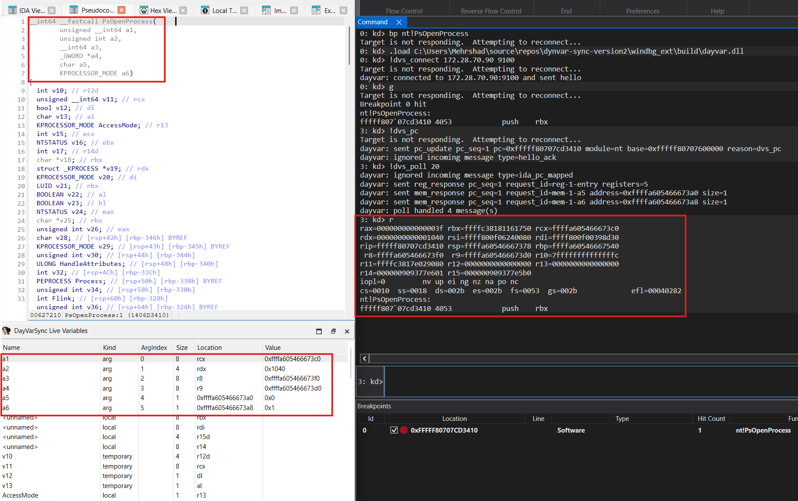
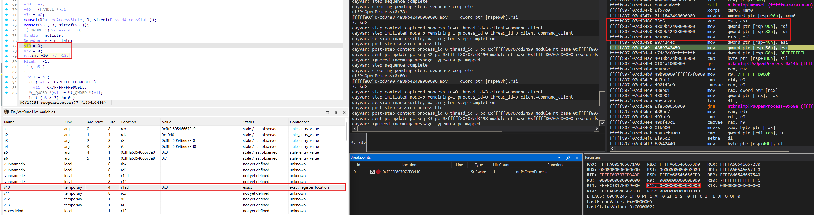

# dynvar-sync v0.1.0-research

> [!IMPORTANT]
> **Development disclosure:** This project was primarily implemented with
> OpenAI Codex under human direction, review, and manual validation. It is a
> vibe-coded research prototype and has not undergone a formal security or
> production-readiness audit.

WinDbg stops at an instruction. `dynvar-sync` moves IDA Pro to the
corresponding address. The `DayVarSync Live Variables` view displays runtime
values only when the IDA-side analysis can structurally prove where the value
currently lives.

`dynvar-sync` is a best-effort, confidence-aware research prototype for
Windows x64 targets using IDA Pro 9.3, Hex-Rays, and WinDbg. It is not a
source-level debugger, is not production-ready, and does not guarantee recovery
of every Hex-Rays lvar.

## What It Does

- Synchronizes a stopped WinDbg PC/module/base with the corresponding IDA EA.
- Displays Hex-Rays variables in a separate Live Variables table.
- Recovers exact-entry Windows x64 arguments for the documented ABI locations.
- Recovers a narrow, structurally proven subset of scalar local values:
  register-backed lvars, exact constants, and same-block stack-backed lvars
  when reliable SP/frame and storage proof exists.
- Preserves previously exact values only as stale / last observed when current
  proof disappears.
- Fails closed for unavailable, ambiguous, unsupported, optimized-away, or
  not-materialized values.

The IDA UI still uses the established `DayVarSync` menu and log names. Those
are implementation/UI identifiers; the public project name is `dynvar-sync`.

## Documentation

- [Installation](docs/06_installation.md)
- [Support matrix and limitations](docs/07_research_prototype_status.md)
- [Variable model](docs/03_variable_model.md)
- [Release notes](docs/release_notes_v0.1.0_research.md)

## Repository Layout

```text
broker\      Python broker and protocol helpers
ida_plugin\  IDAPython plugin modules
windbg_ext\  WinDbg extension source
samples\     Fake clients, tests, and deterministic vvar probe
docs\        Architecture, installation, testing, support, and release docs
tools\       Reserved helper-script area
```

## Localhost Setup

The public guide documents one simple setup:

- IDA Pro runs on Windows.
- WinDbg runs on Windows.
- The Python broker runs on Windows.
- All components connect to `127.0.0.1:9100`.


Start with [Installation](docs/06_installation.md)

## Limitations

Unsupported or unavailable rows are expected for optimized-away values,
ambiguous reaching definitions, unresolved program points, fuzzy stack state,
address-taken or aliased locals, scattered variables, XMM/SIMD/FPU values,
aggregates, unsupported widths, and values requiring execution history after
storage overwrite.

See the [support matrix](docs/07_research_prototype_status.md) for the precise
current boundary.

## Screenshots
<p align="center">
  
</p>

<p align="center">
  
</p>
